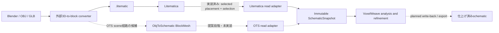
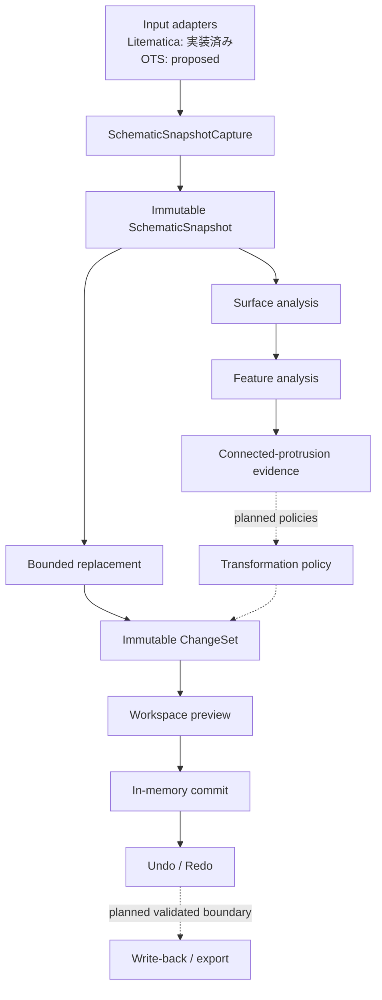
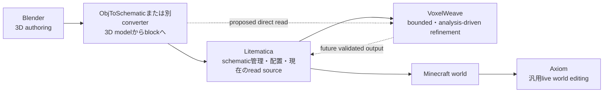
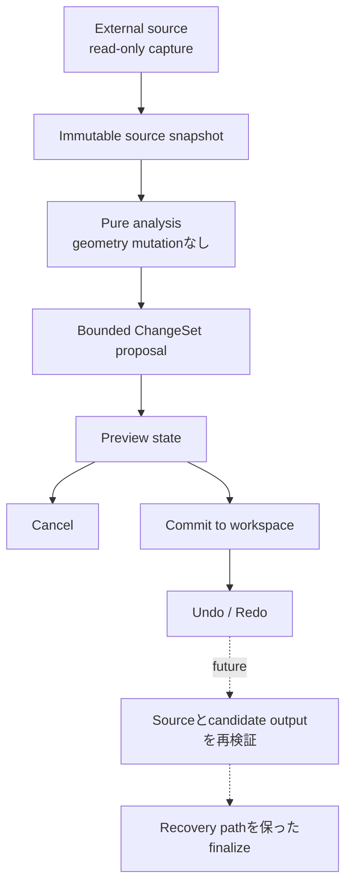
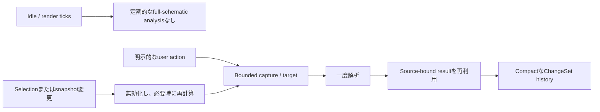

# VoxelWeave

[English](README.md) | **日本語**

## VoxelWeaveとは

VoxelWeaveは、3Dモデル変換で作られたブロック構造を安全に仕上げるためのMinecraftクライアントMODです。変換後のvoxel geometryを解析し、範囲を限定した変更を提案します。Preview・Commit・履歴を分離し、意図的な細部を一律に潰さずに変換artifactを調整できる設計です。

このrepositoryは現在、開発中のprototypeです。pure analysisとメモリ内編集の基盤は実装済みですが、編集UI、schematic write-back、export、ObjToSchematicとの直接連携はまだplannedです。

## 解決したい問題

変換後の建築には、孤立block、細い突起、階段状の輪郭、paletteの不一致、機械的な色遷移などが生じることがあります。一方で、同じgeometryが意図的な尖塔、縁取り、細い装飾である可能性もあります。そのためVoxelWeaveは、policyを適用する前にstructural evidenceを集めます。不明なcontextは不明なまま保持し、局所的に不自然に見えるという理由だけでfeatureを削除しません。

VoxelWeaveはrefinement layerです。OBJやGLBのimport、meshのvoxelize、汎用world editorの置き換えは行いません。

## 制作フロー上の位置

実線は現在のread path、破線はproposedまたはplannedのpathです。



現在実装されている入力は、Litematicaからのbounded read-only captureです。[Issue #20](https://github.com/bosatsuKing/VoxelWeave/issues/20)と[Integration Spike](docs/OTS_INTEGRATION_SPIKE.md)は、ObjToSchematic（OTS）0.2.0からのread-only境界候補を定義しています。OTS adapterやOTS dependencyは追加していません。

OBJとGLBは外部tool向けのupstream formatです。VoxelWeaveへの直接3D-model importは、利用可能な機能でも確定済みのV1 interfaceでもありません。

### 対応済み・plannedの入力

| Input path | 状態 | 境界 |
|---|---|---|
| Selected Litematica placementとcurrent selectionのintersection | 実装済み・read-only | Version固定のoptional Litematica/MaLiLib adapterからcapture |
| Selected OTS 0.2.0 `SceneObject` / valid `BlockMesh` | Proposed | 調査のみ。Production adapter/dependencyなし |
| OBJ / GLB file | Upstreamのみ | VoxelWeaveではなく外部converterへ入力 |
| Minecraft world block | VoxelWeave inputとして未対応 | 現行adapterは任意のworld stateではなくschematic stateを読む |

## 現在の状態

### 実装済みの基盤

- Fabric 26.1.2 client bootstrapと、versionを固定したoptionalなLitematica/MaLiLib開発連携。
- world-spaceのimmutableなselection、placement、operation target、schematic snapshotのdomain型。
- explicit airを含み、placementが曖昧ならfail closedするbounded read-only Litematica capture。
- immutableな`ChangeSet`を生成するdeterministicなblock replacement。
- メモリ内のPreview/Commit分離と、reversibleなUndo/Redo履歴。
- known exposed、interior、unknown-boundary contextを区別するsix-neighbor surface topology。
- face、edge、corner、thin feature、tip、isolated cell、interior、不確実な境界のfeature evidence。
- complete componentだけを対象とするconservativeなdisconnected-island cleanup planning。
- terminationとcontext理由を明示した、TIP起点のbounded connected-protrusion evidence。

これらはAPIとtest済みdomain behaviorです。エンドユーザー向け編集画面はまだありません。workspaceのcommitはVoxelWeaveのimmutableなメモリ内状態だけを変更し、LitematicaやMinecraft worldは変更しません。

### Planned / proposed

- Integration Spikeの条件を満たすread-only OTS 0.2.0 snapshot adapter。
- Connected-protrusion edit policy（Step 7B-2）。
- Feature-preservingなsurface relaxation、smoothing、contour correction。
- Palette inspection/mapping、gradient、pattern、dithering。
- Minecraft内のpreview・editing UI。
- 再検証を伴うLitematica write-backと安全な`.litematic` export/recovery。
- Minecraft 26.2向けに別途検証するbuild line。

## アーキテクチャ

Minecraftとcompanion MODの型はadapter境界で止めます。domain、analysis、transformation、workspace、history layerはconverter-agnosticに保ちます。



### Core concepts

- **Operation target:** operationが変更できる、明示的でboundedな領域。
- **Snapshot:** known coordinateのpoint-in-timeなimmutable map。欠落座標はimplicit airではなくunknown。
- **Analysis evidence:** topologyとfeatureの観測結果。編集許可そのものではない。
- **ChangeSet:** 一つのoperationに含まれる正確なbefore/after block変更。
- **Workspace:** source、committed state、pending preview、reversible history。
- **Source binding:** analysisは、生成元となった同一のimmutable snapshotに対してのみ有効。

完全な契約は、[Architecture](docs/ARCHITECTURE.md)、[Selection and Snapshot Semantics](docs/SELECTION_DOMAIN.md)、[Surface Analysis Semantics](docs/SURFACE_ANALYSIS.md)を参照してください。

## 製品の位置づけ

以下のtoolは同じ制作フローに参加できますが、役割は異なります。Axiomは比較対象としてのみ掲載しており、VoxelWeaveとのintegrationはありません。



### 関連tool比較

| Tool | このフローでの代表的な役割 | VoxelWeaveとの関係 |
|---|---|---|
| Blender | 3D modelのauthoring | Upstream。VoxelWeaveへの直接importなし |
| [ObjToSchematic](https://www.curseforge.com/minecraft/mc-mods/objtoschematic) | 3D modelをMinecraft blockへ変換 | Optional interoperability候補。adapter/dependencyは未実装 |
| [Litematica](https://github.com/maruohon/litematica) | Schematicの管理・配置・編集 | 現行のoptional read-only integration。write-backはplanned |
| VoxelWeave | 変換済みgeometryを解析し、reversibleでboundedな仕上げを提案 | このproject |
| [Axiom](https://modrinth.com/mod/axiom) | 汎用的なreal-time Minecraft world editing | 隣接tool。dependency/integrationなし |

VoxelWeaveはAxiomのcloneではありません。独自の焦点は、変換済みvoxel geometryに対するimmutableでanalysis-drivenなrefinement pipelineと、不確実性・source safetyの明示です。

## Safety model



現在のsafety rule:

- 明示的なselectionとoperation targetだけがedit scopeを与える。
- 欠落contextはunknownのまま保持し、airや確実なgeometryへ暗黙変換しない。
- 曖昧なintegration inputはfail closedする。
- Analysisはsourceを変更せず、stale analysisはsource identityで拒否する。
- PreviewとCommitは別workspace stateであり、historyはreversibleなdeltaを保持する。
- 将来のexternal writeはsourceを再検証し、唯一のknown-good schematicを保護する。

## Performance philosophy

大規模buildを扱うため、処理はexplicit、bounded、reusableに設計します。



- Snapshot captureとanalysisはon demandで実行し、render tickごとのfull-schematic処理にはしない。
- Target、context、traversal budgetで処理量を制限する。
- Surface/feature resultは、同一sourceへのbindingが有効な間だけ再利用する。
- Preview overlayとUndo/Redoは、editごとのschematic全体copyではなくdeltaを保持する。
- 高コストな将来処理は、client-thread safetyを弱めずにprogressとschedulingを提供する。

## Roadmap

```mermaid
flowchart LR
    Foundation["Steps 1-4<br/>domain + workspace<br/>complete"] --> Capture["Step 5<br/>Litematica capture<br/>complete"]
    Capture --> Surface["Steps 6A/6B<br/>surface + features<br/>complete"]
    Surface --> Island["Step 7A<br/>island cleanup planner<br/>complete"]
    Island --> Evidence["Step 7B-1<br/>protrusion evidence<br/>complete"]
    Evidence --> Boundary["Issue #20<br/>OTS boundary decision<br/>under review"]
    Boundary -.-> OTSAdapter["OTS read adapter<br/>proposed"]
    OTSAdapter -.-> Policy["Step 7B-2<br/>edit policy<br/>planned"]
    Policy -.-> Product["UI + write-back + export<br/>planned"]
```



Integration evidenceに応じて順序は変わる可能性があります。この図は状態を示すもので、release dateを約束するものではありません。

## Non-goals

- Proprietaryな3D converterの再実装、または他MODのcode、algorithm、asset、UI、brandingのコピー。
- OTSをすでにrequiredとして扱うこと、OTS JARの同梱、直接OBJ/GLB入力を実装済みとして示すこと。
- 現在のread pathからMinecraft worldを編集・Pasteしたり、server actionを自動化したりすること。
- Preview、bounded scope、undo/recovery、source再検証のないdestructive edit。
- すべてのbuildへ単一のgenericなsmoothing、gradient、procedural styleを適用すること。

## Installation / compatibility

VoxelWeaveは現在、次のbaselineでsourceから開発・検証しています。

| Component | 現在のrepository target | 状態 |
|---|---|---|
| Minecraft | 26.1.2 | 現在の開発・CI対象 |
| Fabric Loader | 0.19.5以上の互換release | Required |
| Fabric API | 0.155.2+26.1.2 | Required |
| Java | 25 | Buildと設定済みMOD runtimeでrequired |
| Litematica | 0.27.12 | Optional dependency。現行read adapterには必要 |
| MaLiLib | 0.28.11 | Litematicaと共に使うoptional dependency |
| ObjToSchematic | 26.1.2向けの監査済み0.2.0 artifact | 調査のみ。dependencyではない |
| Minecraft 26.2 | 独立したFabric build line | Planned。未実装・未検証 |

Minecraft 26.1.2と26.2は、明示的に分けて保守する2つのcompatibility lineとする方針です。26.2 lineではFabric、Litematica、MaLiLib、OTSを採用する場合のartifact/API境界を再検証します。26.1.2の結果を自動的に流用しません。

Checked-in Gradle Wrapperでbuildします。

```text
./gradlew test
./gradlew build
./gradlew build -PwithLitematica=true
```

Default development clientはLitematicaを含めず、optional integrationがない場合に安全に失敗することを確認します。

```text
./gradlew runClient
```

Pinned Litematica/MaLiLib runtimeを含める場合:

```text
./gradlew runClient -PwithLitematica=true
```

World内で`V`を押すとread-only integration diagnosticを表示します。Optional dependencyと利用可能なselected targetの有無を報告し、schematic、world、configは変更しません。

## Contributing / development

Repository ruleは[AGENTS.md](AGENTS.md)、product scopeは[Product Definition](docs/PRODUCT.md)から確認してください。外部MOD型はclient integration adapter内に留め、pure behaviorにはdeterministic testを追加し、runtimeだけのevidenceはautomated passではなくmanual verificationとして記録します。

Documentation-only変更ではcontent、link、diffを確認します。Code/build PRではJDK 25の`test`、default `build`、Litematica-enabled `build` gateを使い、integration behaviorには該当するdev-client smokeも必要です。

Iconとvisual identityは未確定です。[Branding Direction](docs/BRANDING.md)では保守しやすい3案を比較し、Mod Menuの小サイズでも識別できるwoven voxel cubeを推奨しています。
