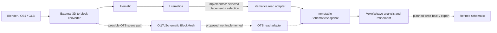
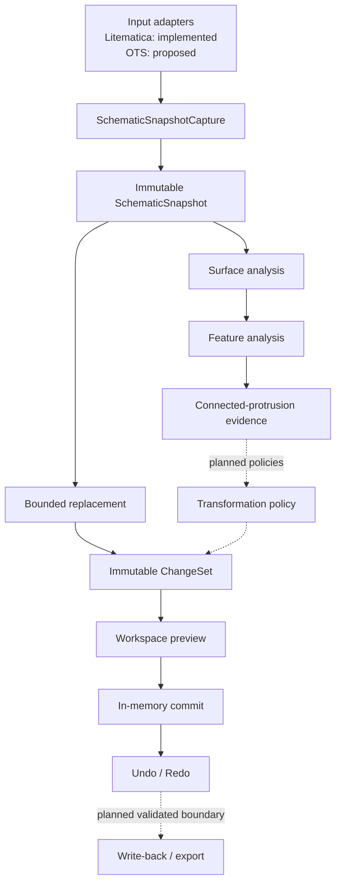
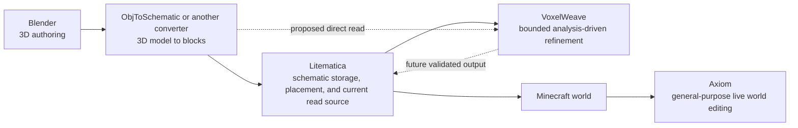
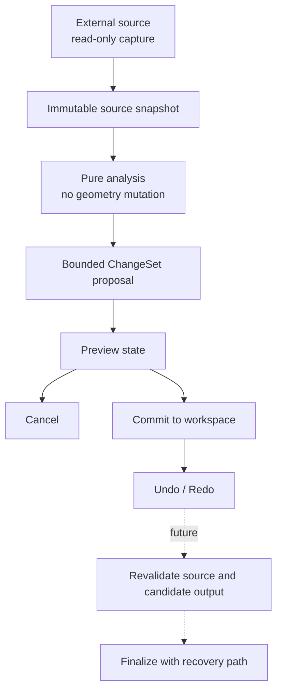
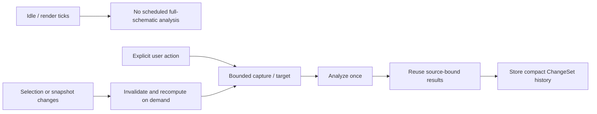

# VoxelWeave

**English** | [日本語](README.ja.md)

## What is VoxelWeave?

VoxelWeave is a client-side Minecraft mod for safely refining block structures created by 3D-model conversion workflows. It sits after conversion: it analyzes voxel geometry, proposes bounded changes, and keeps preview, commit, and history separate so builders can refine artifacts without flattening intentional detail.

The repository is currently a development prototype. Its pure analysis and in-memory editing foundation is implemented; its editing UI, schematic write-back, export, and direct ObjToSchematic integration are still planned.

## What problem does it solve?

Converted builds often contain isolated blocks, narrow spikes, stair-stepped contours, palette mismatches, or repetitive color transitions. The same geometry can also be an intentional tower, trim, or thin decoration. VoxelWeave therefore gathers structural evidence before applying policy. Unknown context remains unknown, and a feature is not removed merely because it looks unusual locally.

VoxelWeave is a refinement layer. It does not import OBJ or GLB files, voxelize meshes, or replace a general-purpose world editor.

## Where it fits

Solid arrows show the current read path. Dashed arrows show proposed or planned paths.



The currently implemented input is a bounded read-only capture from Litematica. [Issue #20](https://github.com/bosatsuKing/VoxelWeave/issues/20) and the accompanying [integration spike](docs/OTS_INTEGRATION_SPIKE.md) define a possible read-only boundary from ObjToSchematic (OTS) 0.2.0. They do not add an OTS adapter or make OTS a dependency.

OBJ and GLB are upstream formats for external tools. Direct 3D-model import into VoxelWeave is not an available feature or a committed V1 interface.

### Supported and planned inputs

| Input path | Status | Boundary |
|---|---|---|
| Selected Litematica placement intersected with the current selection | Implemented, read-only | Captured through the pinned optional Litematica/MaLiLib adapter |
| Selected OTS 0.2.0 `SceneObject` / valid `BlockMesh` | Proposed | Investigation only; no production adapter or dependency |
| OBJ / GLB file | Upstream only | Supplied to an external converter, not read by VoxelWeave |
| Minecraft world blocks | Unsupported as a VoxelWeave input | The current adapter reads schematic state, not arbitrary world state |

## Current status

### Implemented foundation

- Fabric 26.1.2 client bootstrap, with optional pinned Litematica/MaLiLib development integration.
- Immutable world-space selection, placement, operation-target, and schematic-snapshot domain types.
- Bounded read-only Litematica capture that includes explicit air and fails closed on ambiguous placements.
- Deterministic block replacement producing immutable `ChangeSet` values.
- In-memory preview/commit separation and reversible undo/redo history.
- Six-neighbor surface topology with known exposed, interior, and unknown-boundary context.
- Feature evidence for faces, edges, corners, thin features, tips, isolated cells, interiors, and uncertain boundaries.
- Conservative disconnected-island cleanup planning for complete components.
- Bounded connected-protrusion evidence from TIP cells, with explicit termination and context reasons.

These pieces are APIs and tested domain behavior. There is no end-user editing screen yet. A workspace commit changes VoxelWeave's immutable in-memory state only; it does not modify Litematica or the Minecraft world.

### Planned or proposed

- A read-only OTS 0.2.0 snapshot adapter, subject to the conditions in the integration spike.
- Connected-protrusion edit policy (Step 7B-2).
- Feature-preserving surface relaxation, smoothing, and contour correction.
- Palette inspection/mapping, gradients, patterns, and dithering.
- Minecraft preview and editing UI.
- Revalidated Litematica write-back and safe `.litematic` export/recovery.
- A separately verified Minecraft 26.2 build line.

## Architecture

Minecraft and companion-mod types stop at the adapter boundary. The domain, analysis, transformation, workspace, and history layers remain converter-agnostic.



### Core concepts

- **Operation target:** the explicit bounded region an operation may affect.
- **Snapshot:** an immutable point-in-time map of known coordinates. A missing coordinate is unknown, not implicit air.
- **Analysis evidence:** topology and feature observations; it is not permission to edit.
- **ChangeSet:** the exact before/after block changes for one operation.
- **Workspace:** source, committed state, pending preview, and reversible history.
- **Source binding:** analysis is valid only for the exact immutable snapshot from which it was produced.

See [Architecture](docs/ARCHITECTURE.md), [selection and snapshot semantics](docs/SELECTION_DOMAIN.md), and [surface-analysis semantics](docs/SURFACE_ANALYSIS.md) for the full contracts.

## Product positioning

These tools can participate in the same building workflow, but they have different responsibilities. Axiom is included for comparison only; VoxelWeave has no Axiom integration.



### Related tools comparison

| Tool | Representative role here | Relationship to VoxelWeave |
|---|---|---|
| Blender | Author a 3D model | Upstream; no direct VoxelWeave import |
| [ObjToSchematic](https://www.curseforge.com/minecraft/mc-mods/objtoschematic) | Convert a 3D model into Minecraft blocks | Optional interoperability candidate; adapter and dependency are not implemented |
| [Litematica](https://github.com/maruohon/litematica) | Manage, place, and edit schematics | Current optional read-only integration; write-back is planned |
| VoxelWeave | Analyze converted geometry and propose reversible, bounded refinement | This project |
| [Axiom](https://modrinth.com/mod/axiom) | General-purpose real-time Minecraft world editing | Adjacent tool; no dependency or integration |

VoxelWeave is not an Axiom clone. Its distinct focus is an immutable, analysis-driven refinement pipeline for converted voxel geometry, with uncertainty and source safety represented explicitly.

## Safety model



The current safety rules are:

- Only explicit selections and operation targets grant edit scope.
- Missing context stays unknown; it is never silently converted to air or confident geometry.
- Ambiguous integration input fails closed.
- Analysis does not mutate its source, and stale analysis is rejected by source identity.
- Preview and commit are separate workspace states; history stores reversible deltas.
- Future external writes must revalidate their source and preserve the only known-good schematic.

## Performance philosophy

VoxelWeave is designed for large builds, so work is explicit, bounded, and reusable.



- Snapshot capture and analysis are invoked on demand, not as full-schematic render-tick work.
- Targets, context, and traversal budgets bound the work.
- Surface and feature results are reused only while their exact source binding remains valid.
- Preview overlays and undo/redo retain deltas instead of copying the whole schematic for each edit.
- Expensive future operations should expose progress and scheduling without weakening client-thread safety.

## Roadmap

```mermaid
flowchart LR
    Foundation["Steps 1-4<br/>domain + workspace<br/>complete"] --> Capture["Step 5<br/>Litematica capture<br/>complete"]
    Capture --> Surface["Steps 6A/6B<br/>surface + features<br/>complete"]
    Surface --> Island["Step 7A<br/>island cleanup planner<br/>complete"]
    Island --> Evidence["Step 7B-1<br/>protrusion evidence<br/>complete"]
    Evidence --> Boundary["Issue #20<br/>OTS boundary decision<br/>under review"]
    Boundary -.-> OTSAdapter["OTS read adapter<br/>proposed"]
    OTSAdapter -.-> Policy["Step 7B-2<br/>edit policy<br/>planned"]
    Policy -.-> Product["UI + write-back + export<br/>planned"]
```



Roadmap order may change as integration evidence improves. The diagram reports status; it does not promise a release date.

## Non-goals

- Reimplementing a proprietary 3D converter or copying another mod's code, algorithms, assets, UI, or branding.
- Treating OTS as already required, bundling its JAR, or presenting direct OBJ/GLB input as implemented.
- Editing the Minecraft world, pasting blocks, or automating server actions as part of the current read path.
- Destructive edits without preview, bounded scope, undo/recovery, and source revalidation.
- Applying one generic smoothing, gradient, or procedural style to every build.

## Installation and compatibility

VoxelWeave is currently developed and verified from source against this baseline:

| Component | Current repository target | Status |
|---|---|---|
| Minecraft | 26.1.2 | Current development and CI target |
| Fabric Loader | 0.19.5 or newer compatible release | Required |
| Fabric API | 0.155.2+26.1.2 | Required |
| Java | 25 | Required for the build and configured mod runtime |
| Litematica | 0.27.12 | Optional dependency; required for the current read adapter |
| MaLiLib | 0.28.11 | Optional dependency used with Litematica |
| ObjToSchematic | Audited 0.2.0 artifact for 26.1.2 | Investigated only; not a dependency |
| Minecraft 26.2 | Separate Fabric build line | Planned; not implemented or verified |

Minecraft 26.1.2 and 26.2 are intended as two explicitly maintained compatibility lines. The 26.2 line must revalidate its Fabric, Litematica, MaLiLib, and any OTS artifact/API boundary; a 26.1.2 result is not automatically carried forward.

Build with the checked-in Gradle Wrapper:

```text
./gradlew test
./gradlew build
./gradlew build -PwithLitematica=true
```

The default development client omits Litematica so the missing optional integration can fail safely:

```text
./gradlew runClient
```

To include the pinned Litematica/MaLiLib runtime:

```text
./gradlew runClient -PwithLitematica=true
```

Press `V` in a world to display the read-only integration diagnostic. It reports whether the optional dependencies and a usable selected target are present. It does not edit a schematic, world, or configuration.

## Contributing and development

Start with [AGENTS.md](AGENTS.md) for repository rules and [Product Definition](docs/PRODUCT.md) for product scope. Keep external mod types inside client integration adapters, add deterministic tests for pure behavior, and describe runtime-only evidence as manual verification rather than an automated pass.

Documentation-only changes require content, link, and diff checks. Code/build pull requests use the JDK 25 `test`, default `build`, and Litematica-enabled `build` gates; integration behavior also needs the relevant dev-client smoke test.

The icon and visual identity are not final. [Branding direction](docs/BRANDING.md) compares three maintainable concepts and recommends a woven voxel cube designed to remain readable at Mod Menu sizes.
