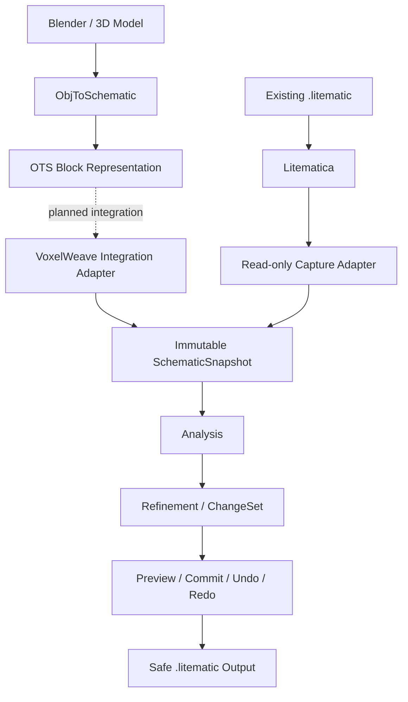
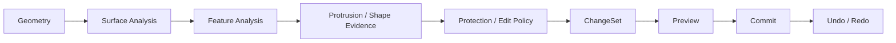
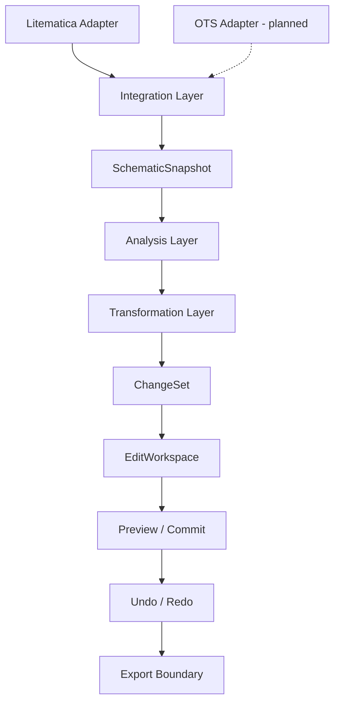

# VoxelWeave

[English](README.md) | **日本語**

VoxelWeave は、**Blender などで作成した 3D モデルを Minecraft のブロック構造へ変換したあと、Minecraft 内で形状・色・表面を細かく仕上げるためのクライアント MOD**です。

目標は、単純に「全部を同じように滑らかにする」ことではありません。変換時に生まれたノイズや不自然な突起を整理しつつ、尖塔・縁・細い装飾など作者が意図した形状はできるだけ保護し、最終的な建築表現をユーザー自身が調整できる編集環境を目指しています。

> **ObjToSchematic が「3D → Minecraft への変換」、VoxelWeave が「Minecraft 建築としての仕上げ」を担当する**、という役割分担を V1 の基本方針としています。

## 目指している制作フロー

```text
Blender / 3D モデル
        ↓
3D モデルを書き出す
        ↓
ObjToSchematic (OTS)
        ↓
Minecraft のブロック構造へ変換
        ↓
VoxelWeave
 ├─ 形状を解析
 ├─ 変換ノイズを見つける
 ├─ 意図的な細部を保護
 ├─ Smooth / Surface Relax
 ├─ 輪郭補正
 ├─ Palette / Gradient
 ├─ Pattern / Dither
 ├─ Before / After Preview
 └─ Undo / Redo
        ↓
Litematica / .litematic
        ↓
仕上げ済みの建築データ
```

現在は、ObjToSchematic 0.2.0 の変換結果を VoxelWeave の `SchematicSnapshot` へ安全に渡す integration boundary を調査しています。**OTS の hard dependency 化や本番 adapter はまだ未実装**です。

既存の `.litematic` を Litematica から読み取る経路も、現在の実装として維持しています。



## なぜ VoxelWeave を作るのか

3D モデルを Minecraft のブロックへ変換すると、元の造形意図とは別に、変換方式や解像度によって次のような調整ポイントが生まれます。

- 孤立したブロックや小さな変換ノイズ
- 不自然な細い突起や段差
- 階段状になった表面や輪郭
- 元モデルと合わないブロック palette
- 色の切り替わりが機械的に見える部分
- 変換後に Minecraft 上で手作業しないと仕上がらない細部

VoxelWeave は、これらを一括で「ノイズ」と決めつけません。

同じ形でも、ある建築では変換 artifact であり、別の建築では意図した尖塔や装飾である可能性があります。そのため、まず geometry を解析して evidence を集め、**作者の意図を勝手に推測して破壊しない**ことを重要な原則にしています。



## 現在できていること

現時点の実装には、非破壊編集と形状解析の基盤が入っています。

1. Minecraft 26.1.2 / Fabric の client bootstrap。
2. Litematica / MaLiLib との read-only integration。
3. world-space の immutable な selection / placement / operation target。
4. bounded な block replacement と immutable `ChangeSet`。
5. Preview → Commit を分離した `EditWorkspace`。
6. VoxelWeave 操作に対する Undo / Redo。
7. Litematica の選択範囲を immutable `SchematicSnapshot` として capture。
8. six-neighbor topology による surface / component analysis。
9. FACE / EDGE / CORNER / TIP / THIN_FEATURE / ISOLATED / INTERIOR / UNKNOWN_BOUNDARY の feature evidence。
10. complete な小規模 disconnected island に対する conservative cleanup planning。
11. TIP 起点・1-voxel 幅の connected protrusion に対する bounded evidence analysis。

Connected protrusion analysis は、突起を自動的に artifact と判定するものではありません。現在のモデルで evidence が見つからなくても、**artifact が存在しないことを意味しません**。

## これから実装するもの

主な予定は次の通りです。

- ObjToSchematic → VoxelWeave の安全な snapshot adapter
- connected protrusion cleanup policy / ChangeSet
- feature-preserving Surface Relax / Smooth
- contour correction
- palette inspection / mapping
- gradient
- pattern
- dithering
- Minecraft 内の Before / After preview UI
- Litematica write-back
- 安全な `.litematic` export / recovery

色編集は、単独機能ではなく組み合わせ可能な pipeline として扱う予定です。

```text
Selection
   ↓
Surface Mask
   ↓
Gradient
   ↓
Pattern
   ↓
Dither
   ↓
Palette Mapper
   ↓
ChangeSet
   ↓
Preview
```

この構造にすることで、毎回同じ見た目になる固定的なグラデーションや smoothing を避け、建築ごとに調整できるようにします。

## 安全性と編集方針

VoxelWeave は schematic を直接壊す編集を避けます。

```text
Source Schematic
      ↓
Immutable Snapshot
      ↓
Analysis
      ↓
Proposed ChangeSet
      ↓
Preview
   ┌──┴──┐
Cancel  Commit
          ↓
      Undo / Redo
          ↓
Safe Export
```

特に次を守ります。

- missing / unknown な周辺データを勝手に air と扱わない
- selection 外の geometry を編集しない
- stale な analysis を新しい snapshot へ適用しない
- mutation 前に source / target を再確認する
- export に失敗しても元 schematic の recovery path を残す
- analysis / domain layer に Minecraft / Litematica / OTS 固有型を持ち込まない

## ObjToSchematic との役割分担

VoxelWeave は、3D converter そのものを再実装することを V1 の中心目的にはしていません。

```text
ObjToSchematic
 └─ 3D model import
 └─ voxelization
 └─ Minecraft block assignment

VoxelWeave
 └─ conversion result analysis
 └─ noise / shape refinement
 └─ creator-intent preservation
 └─ palette / color design
 └─ preview / history
 └─ safe schematic workflow
```

ObjToSchematic 0.2.0 との直接連携については、現在 [Issue #20](https://github.com/bosatsuKing/VoxelWeave/issues/20) で、座標系・BlockState・revision・immutable copy・dependency・配布条件などを調査しています。

OTS のコード・asset・voxeliser を VoxelWeave にコピーする方針ではありません。連携する場合も integration adapter の境界に閉じ込め、VoxelWeave Core は converter-agnostic に保ちます。

## 対応バージョン方針

VoxelWeave は、ObjToSchematic の現在のリリース構成と同様に、**Minecraft 26.1.2 と 26.2 の 2 バージョンを並行してサポートする方針**です。

| Minecraft | VoxelWeave | 状態 |
|---|---|---|
| 26.1.2 | Fabric | 現在の開発・検証対象 |
| 26.2 | Fabric | 対応予定 |

現時点の repository は **26.1.2 / Fabric / JDK 25** を基準に実装されています。26.2 対応は方針として決定していますが、まだ実装・検証済みとはみなしません。

## 現在のアーキテクチャ



### Integration Layer

Fabric lifecycle、Litematica / MaLiLib、将来の OTS adapter など、外部 MOD との境界を担当します。

### Domain / Snapshot

Minecraft の API から切り離した immutable data を扱います。解析・編集ロジックの共通入口が `SchematicSnapshot` です。

### Analysis Layer

geometry を変更せず、surface topology・feature・connected path などの structural evidence を計算します。

### Transformation / History

解析結果と明示的な policy から `ChangeSet` を生成し、Preview / Commit / Undo / Redo を行います。

### Export Boundary

最終的には candidate → temporary output → validation → finalize の順で安全に保存し、正常な source schematic を壊さない設計にします。

## まだできないこと

次の機能は、README に構想が書かれていても**現時点では完成していません**。

- ObjToSchematic の production adapter / hard dependency
- Step 7B-2 connected protrusion cleanup
- Minecraft 上の編集 preview renderer / UI
- geometry smoothing / relaxation / contour transformation
- gradient / pattern / dithering の実編集
- Litematica schematic write-back
- safe `.litematic` export
- Minecraft 26.2 対応

## 開発環境

現在の基準環境:

```text
Minecraft 26.1.2
Fabric Loader 0.19.5
Fabric API 0.155.2+26.1.2
Litematica 0.27.12
MaLiLib 0.28.11
JDK 25
```

ビルド:

```text
./gradlew build
```

テスト:

```text
./gradlew test
```

Litematica / MaLiLib を開発 runtime に含める場合:

```text
./gradlew build -PwithLitematica=true
./gradlew runClient -PwithLitematica=true
```

Pull Request では JDK 25 の GitHub Actions で、test・default build・Litematica-enabled build を確認します。Minecraft / Litematica の interactive smoke test は別途手動確認します。

## 開発ドキュメント

- [AGENTS.md](AGENTS.md) — 実装・検証ルール
- [Product Definition](docs/PRODUCT.md) — 製品方針
- [Architecture](docs/ARCHITECTURE.md) — レイヤー境界
- [Selection Domain](docs/SELECTION_DOMAIN.md) — selection / snapshot semantics
- [Surface Analysis](docs/SURFACE_ANALYSIS.md) — surface / feature / protrusion analysis
- [Issue #20](https://github.com/bosatsuKing/VoxelWeave/issues/20) — ObjToSchematic integration spike

## プロジェクトの考え方

VoxelWeave が目指すのは、ツール側の癖を建築へ押し付けることではありません。

**3D → Minecraft 変換ツールが形を作り、VoxelWeave が Minecraft 建築として仕上げる。**

そのとき、作者が作った大きな形・輪郭・尖塔・細部を残しながら、変換によって生じた不自然さだけを安全に調整できることを目標にしています。
